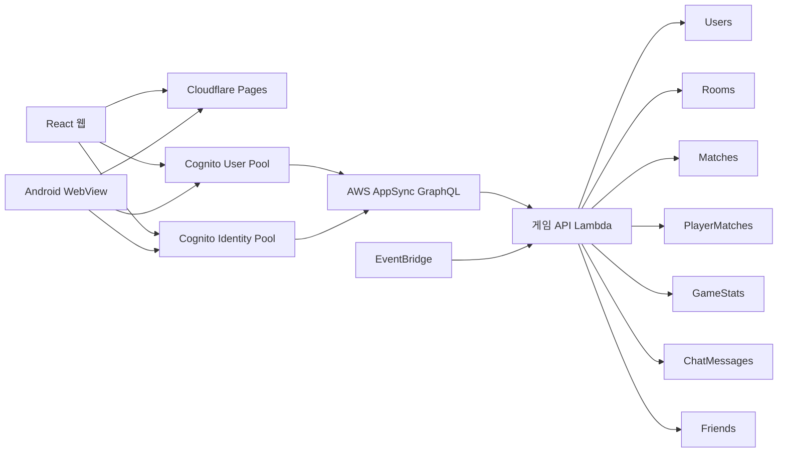

<div align="center">
  
  <h1>MiniGameJoin</h1>
  <p>
    설치 없이 브라우저에서 바로 즐기는 온라인 미니게임 플랫폼<br />
    Yacht Dice는 로컬·온라인으로, 가위바위보는 실시간 온라인으로 플레이할 수 있습니다.
  </p>

  <p>
    <a href="https://mini-gamejoin.pages.dev/"><strong>게임 실행하기</strong></a>
    ·
    <a href="./backend/appsync/SETUP.md"><strong>AWS 설정 가이드</strong></a>
  </p>

  <p>
    
    
    
    
    
    
  </p>
</div>

> **현재 상태:** Yacht Dice와 가위바위보의 온라인 플레이를 실제 AWS 환경에서 제공합니다.<br />
> 회원과 게스트 모두 초대 코드로 참가할 수 있으며, 전적은 게임별로 따로 기록됩니다.

## 현재 구현 현황

| 구분 | 로컬 플레이 | 온라인 플레이 | 인원 |
|---|:---:|:---:|---:|
| Yacht Dice | ✅ | ✅ | 2명 |
| 가위바위보 | — | ✅ | 2~6명 |

### 공통 온라인 기능

- Cognito 회원가입, 이메일 인증, 로그인 및 세션 복구
- 비밀번호 재설정, 닉네임·이메일 변경, 회원탈퇴
- Cognito Identity Pool 기반 게스트 플레이
- 6자리 초대 코드로 방 생성 및 참가
- 동일 계정의 로그인은 허용하되 방 생성·게임 참가는 한 곳에서만 가능
- 방장, 참가자, 준비 상태 및 관전자 구분
- 대기방 채팅과 게임 채팅
- 친구 검색, 친구 요청·수락·삭제, 접속 상태 및 방 초대
- 게임마다 분리된 승·패·무승부·승률과 경기 상세 기록
- 낙관적 버전 검증을 통한 중복 요청 및 동시 조작 방지
- heartbeat와 종료 유예시간을 이용한 연결 종료 판정
- 브라우저 새로고침·탭 종료·앱 종료 시 방 나가기 또는 기권 처리
- PC, 모바일, 태블릿 대응 반응형 UI
- Android WebView 앱 연동 및 업데이트 안내

## 게임

### Yacht Dice

다섯 개의 주사위를 최대 세 번 굴려 12개 점수 항목을 완성하는 2인 턴제 게임입니다.

#### 로컬 모드

- 한 화면에서 1P와 2P가 번갈아 진행
- 플레이어 닉네임 설정
- 최대 3회 굴림과 원하는 주사위 보관
- 선택 가능한 예상 점수와 확정 점수 구분
- 상단 숫자 합계 63점 이상이면 30점 보너스
- 모든 점수 항목을 채우면 최종 승자 판정

#### 온라인 모드

- 방장이 두 명의 플레이어를 선택하고 나머지는 관전
- 서버에서 주사위 생성과 점수 재검증
- 실시간 턴·주사위·점수 상태 동기화
- 뒤로가기 및 방 나가기 시 기권 확인
- 연결 종료 후 유예시간을 적용해 승패 처리
- 게스트가 포함된 경기는 회원 전적에서 제외

#### 점수 항목

| 항목 | 계산 방식 |
|---|---|
| Ones ~ Sixes | 해당 숫자 주사위의 합 |
| Choice | 주사위 5개의 합 |
| Four of a Kind | 같은 숫자가 4개 이상이면 주사위 합 |
| Full House | 3개와 2개 조합이면 주사위 합 |
| Small Straight | 연속 숫자 4개 이상이면 15점 |
| Large Straight | 연속 숫자 5개면 30점 |
| Yacht | 같은 숫자 5개면 50점 |

### 가위바위보

2명부터 최대 6명까지 같은 방에서 플레이하는 실시간 온라인 게임입니다. 별도 대기 로비로 이동하지 않고 게임 화면에서 참가자를 기다린 뒤 바로 시작합니다.

#### 방장 설정

- 게임 방식: `1:1 토너먼트` 또는 `전체 난투전`
- 선택 제한시간: 5초, 10초, 15초, 20초
- 승리 조건: 1~3승 선취
- 전체 난투전 생명: 1~3개
- 방 정원: 2~6명
- 모바일에서는 화면 오른쪽 위 `규칙 설정` 버튼으로 설정창 표시

#### 진행 방식

- 참가자는 `준비 하기` 버튼으로 준비하고 다시 눌러 취소 가능
- 준비 완료 상태에서는 버튼에 `대기 중` 표시
- 선택 제한시간이 끝나면 미선택 손을 서버에서 무작위 결정
- 선택 내용은 공개 전까지 다른 참가자에게 노출하지 않음
- 모든 선택이 완료되거나 시간이 끝나면 서버가 승패 판정
- 결과 공개 후 자동으로 다음 턴으로 넘어가지 않음
- 방장이 `다음 턴`을 눌러야 다음 라운드 또는 다음 대진 진행
- 방장 권한은 UI뿐 아니라 Lambda에서도 검증
- 대기 중 뒤로가기를 누르면 방 나가기 확인창 표시
- 탭·창·앱 종료가 감지되면 대기 중에는 방 나가기, 경기 중에는 기권 처리

#### 사운드

- 대기, 손 선택, 긴급 카운트다운, 결과, 최종 승패에 따라 다른 음악과 효과음 재생
- 카운트다운 원형 게이지가 남은 시간에 맞춰 변화
- 사용자 설정으로 가위바위보 사운드 음소거 가능
- 절차적으로 생성한 음악과 CC0 음원을 사용해 저작권 문제 최소화

## UI와 게임 연출

- Yacht Dice와 가위바위보가 같은 디자인 언어 사용
- 데스크톱과 모바일에 맞춘 반응형 레이아웃
- Three.js와 Rapier 기반 3D 물리 주사위
- 굴리기, 보관, 점수 확정, Yacht 달성, 턴 전환 효과음
- 게임 진행 상황에 따라 달라지는 적응형 배경음악
- Yacht 달성 축하 오버레이
- 모바일 상단에 중요한 게임 동작을 우선 배치
- 전적 상세창 오른쪽 위 닫기 버튼

## 시스템 구조



### 서버 권위형 처리

클라이언트는 입력만 전달하고 최종 게임 결과는 Lambda가 계산합니다.

- Yacht Dice 주사위 값 생성과 점수 계산
- 가위바위보 제한시간과 미선택 손 무작위 결정
- 가위바위보 승패·생명·토너먼트 대진 계산
- 현재 참가자, 방장, 턴, 준비 상태 검증
- 경기 결과와 게임별 전적 저장
- 방 상태의 `version`을 이용한 동시 요청 제어

### 게임별 전적

전적은 `userId + gameId` 조합으로 분리합니다. Yacht Dice의 승패는 가위바위보 전적에 영향을 주지 않으며, 앞으로 게임을 추가해도 각 게임의 전적이 별도로 누적됩니다.

## 기술 스택

| 영역 | 사용 기술 |
|---|---|
| 프론트엔드 | React 19, TypeScript 6, Vite 8, React Router |
| 3D 게임 | Three.js, Rapier 3D |
| 인증 | Amazon Cognito User Pool, Identity Pool |
| API | AWS AppSync GraphQL |
| 서버 | AWS Lambda, Node.js |
| 데이터 | Amazon DynamoDB |
| 연결 감지 | heartbeat, Amazon EventBridge |
| 웹 호스팅 | Cloudflare Pages |
| 모바일 | Android Kotlin WebView |
| 테스트 | Vitest, Node Test Runner, oxlint |

## 로컬 실행

### 요구 사항

- Node.js 22 (`.node-version`: `22.22.0`)
- npm
- 온라인 기능을 사용하려면 별도로 구성된 AWS 리소스

### 설치

```bash
git clone https://github.com/Mobil0010/MiniGameJoin.git
cd MiniGameJoin
npm install
```

### 환경 변수

`.env.example`을 `.env.local`로 복사한 뒤 실제 AWS 값을 입력합니다.

```env
VITE_AWS_REGION=ap-northeast-2
VITE_COGNITO_USER_POOL_ID=YOUR_USER_POOL_ID
VITE_COGNITO_APP_CLIENT_ID=YOUR_APP_CLIENT_ID
VITE_COGNITO_IDENTITY_POOL_ID=YOUR_IDENTITY_POOL_ID
VITE_COGNITO_GUEST_ROLE_ARN=YOUR_GUEST_ROLE_ARN
VITE_APPSYNC_GRAPHQL_URL=https://YOUR_API_ID.appsync-api.ap-northeast-2.amazonaws.com/graphql
```

AWS 환경 변수가 없어도 로컬 Yacht Dice는 실행할 수 있지만 회원·게스트 온라인 기능은 사용할 수 없습니다.

### 개발 서버

```bash
npm run dev
```

기본 주소는 `http://localhost:5173`입니다.

### 품질 검사

```bash
npm test
npm run lint
npm run build
```

Lambda 게임 규칙 테스트:

```bash
cd backend/lambda/game-api
npm install
npm test
```

## AWS 배포

AWS를 처음부터 구성하거나 이미 존재하는 환경에 업데이트할 때는 아래 문서를 사용합니다.

- [AppSync, Lambda, DynamoDB 설정](./backend/appsync/SETUP.md)
- [Cognito 게스트 접속 설정](./backend/appsync/GUEST_SETUP.md)
- [백엔드 파일 안내](./backend/README.md)

Lambda 업로드 ZIP 생성:

```powershell
powershell.exe -NoProfile -ExecutionPolicy Bypass -File ".\backend\scripts\build-lambda.ps1"
```

생성 위치:

```text
backend/dist/MiniGameJoinApiHandler.zip
```

> 이미 동일한 DynamoDB 테이블이나 AWS 리소스가 있다면 다시 생성하지 마세요.<br />
> [SETUP.md](./backend/appsync/SETUP.md)의 기존 리소스 확인 절차에 따라 누락된 항목만 추가합니다.

## Cloudflare Pages 배포

| 설정 | 값 |
|---|---|
| Build command | `npm run build` |
| Build output directory | `dist` |
| Node.js | `22` |

Cloudflare Pages 환경 변수에도 `.env.local`과 같은 `VITE_*` 값을 등록해야 합니다. GitHub 저장소와 Pages를 연결하면 기본 브랜치 변경 시 자동으로 새 버전을 배포할 수 있습니다.

## Android 연동

웹 클라이언트는 Android 네이티브 브리지와 다음 기능을 연동합니다.

- 온라인 경기 중 화면 자동 꺼짐 방지
- 주사위·점수·턴·채팅 상황별 진동과 알림음
- 초대 코드를 Android 공유창으로 전달
- 앱 버전 확인과 선택·필수 업데이트 안내
- 오프라인 또는 페이지 로딩 실패 시 재시도 화면
- Android 뒤로가기와 웹 게임의 나가기·기권 흐름 연결

업데이트 정보는 [public/app-update.json](./public/app-update.json)에서 관리합니다.

## 프로젝트 구조

```text
MiniGameJoin/
├─ public/
│  ├─ audio/                       # 게임 음원과 라이선스
│  ├─ app-update.json              # Android 업데이트 정보
│  └─ favicon.svg
├─ src/
│  ├─ audio/                       # 상황별 음악·효과음 제어
│  ├─ components/                  # 공통 및 Android 연동 UI
│  ├─ features/
│  │  ├─ auth/                     # Cognito 회원 인증
│  │  └─ online-multiplayer/       # 방, 채팅, 친구, 전적, 온라인 게임
│  ├─ games/yacht-dice/            # Yacht Dice UI와 로컬 규칙
│  ├─ pages/                        # 라우트 페이지
│  └─ platform/                    # Android 네이티브 브리지
├─ backend/
│  ├─ appsync/                     # GraphQL 스키마와 Resolver
│  ├─ iam/                         # Lambda DynamoDB 권한 예시
│  ├─ lambda/game-api/             # 서버 게임 규칙과 API 핸들러
│  └─ scripts/                     # Lambda 패키징 스크립트
├─ .env.example
├─ package.json
└─ vite.config.ts
```

## 현재 남은 작업

- 실제 여러 기기 환경에서 가위바위보 2~6인 부하·동기화 검증
- 네트워크 복구 상태와 강제 종료 처리 고도화
- 프런트엔드 번들 코드 분할
- 운영 모니터링 및 오류 추적 강화
- 새로운 미니게임 추가

## 오디오 라이선스

일부 UI·게임 효과음은 CC0 라이선스인 다음 리소스를 사용합니다.

- [Kenney Casino Audio](https://kenney.nl/assets/casino-audio)
- [Kenney Interface Sounds](https://kenney.nl/assets/interface-sounds)

절차적으로 생성한 Yacht Dice 및 가위바위보 음악에 대한 설명과 외부 음원의 라이선스 사본은 [`public/audio`](./public/audio)에서 확인할 수 있습니다.

## 라이선스

현재 저장소에는 별도의 오픈소스 라이선스 파일이 포함되어 있지 않습니다. 소스 코드 사용·재배포 조건은 저장소 소유자에게 문의하세요.
