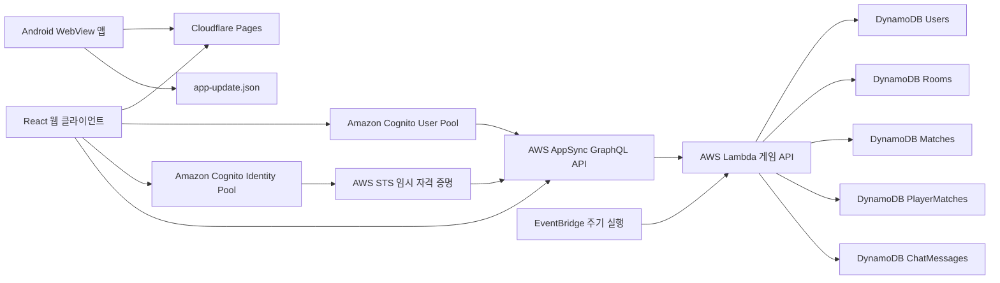
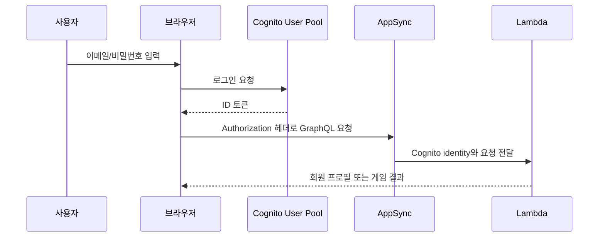
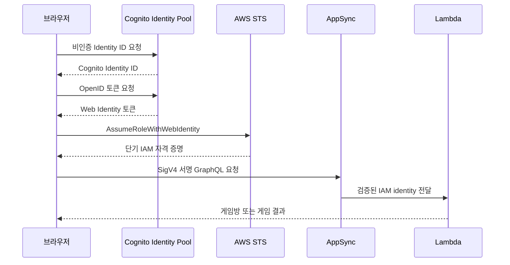

<div align="center">
  
  <h1>MiniGameJoin</h1>
  <p>
    설치 없이 브라우저에서 바로 즐기는 미니게임 플랫폼.<br />
    현재 Yacht Dice의 로컬 2인 플레이와 AWS 기반 온라인 2인 플레이를 제공합니다.
  </p>

  <p>
    
    
    
    
    
    
  </p>
</div>

> **프로젝트 상태:** 온라인 플레이 제공 중
>
> Yacht Dice의 회원/게스트 인증, 온라인 방, 채팅, 전적, 관전 및 기권 처리를 실제 AWS 환경에서 제공합니다.

---

## 목차

- [프로젝트 소개](#프로젝트-소개)
- [현재 제공 기능](#현재-제공-기능)
- [Yacht Dice 규칙](#yacht-dice-규칙)
- [전체 아키텍처](#전체-아키텍처)
- [기술 스택](#기술-스택)
- [프론트엔드 설계](#프론트엔드-설계)
- [Android 앱](#android-앱)
- [백엔드 설계](#백엔드-설계)
- [인증과 권한](#인증과-권한)
- [온라인 게임 동기화](#온라인-게임-동기화)
- [데이터 모델](#데이터-모델)
- [GraphQL API](#graphql-api)
- [보안 설계](#보안-설계)
- [프로젝트 구조](#프로젝트-구조)
- [로컬 개발 환경 설정](#로컬-개발-환경-설정)
- [테스트와 품질 검사](#테스트와-품질-검사)
- [AWS 백엔드 배포](#aws-백엔드-배포)
- [Cloudflare Pages 배포](#cloudflare-pages-배포)
- [Android 앱 빌드와 배포](#android-앱-빌드와-배포)
- [문제 해결](#문제-해결)
- [로드맵](#로드맵)

## 프로젝트 소개

MiniGameJoin은 하나의 웹사이트에서 여러 종류의 미니게임을 로컬 또는 온라인으로 즐길 수 있도록 만드는 프로젝트입니다.

현재 첫 번째 게임으로 **Yacht Dice**를 구현했습니다. 한 화면에서 두 명이 번갈아 플레이하는 로컬 모드와, 서로 다른 브라우저에서 초대 코드로 같은 방에 접속하는 온라인 모드를 모두 지원합니다.

프로젝트의 주요 목표는 다음과 같습니다.

- 별도의 프로그램 설치 없이 웹 브라우저에서 즉시 플레이
- 데스크톱과 모바일 화면에 대응하는 반응형 UI
- 로컬 2인 플레이와 온라인 2인 플레이를 동일한 게임 규칙으로 제공
- 회원뿐 아니라 가입하지 않은 게스트도 온라인 플레이 가능
- 주사위 결과와 점수 계산을 서버에서 검증하는 안전한 온라인 게임
- 새로운 미니게임을 독립된 기능 단위로 추가할 수 있는 구조
- 동일한 웹 게임을 Android 휴대폰과 태블릿에서도 실행할 수 있는 WebView 앱

## 현재 제공 기능

### 공통

- 홈 화면과 게임 선택 화면
- 반응형 웹 레이아웃
- MiniGameJoin 전용 파비콘
- Yacht Dice 전체 규칙 가이드
- 최초 접속자용 게임 안내 모달
- 안내를 다시 보지 않도록 브라우저에 선택 저장
- Yacht 달성 시 3초 동안 축하 오버레이 표시
- Three.js와 Rapier 기반 실시간 3D 물리 주사위 애니메이션
- 실제 3D 중력, 바닥·벽·주사위 충돌, 반발력, 마찰과 회전을 프레임마다 계산
- 게임 화면에서만 3D 엔진을 지연 로딩하고 애니메이션이 끝나면 렌더링 중단
- 모바일에서도 3D 보드의 `45:14` 가로·세로 비율을 유지한 채 동일 비율로 축소
- 주사위 굴림, KEEP, 점수 확정, 조합 완성, Yacht, 온라인 턴 전환 효과음
- Yacht Dice의 진행 상황에 따라 달라지는 Web Audio 기반 적응형 배경음악
- 온라인 경기 종료 시 접속자 기준 승리 팡파르·패배 효과음, 로컬 경기 승자 축하음
- 가위바위보의 대기·선택·긴급 카운트다운·승패 상황별 절차형 배경음악
- 확정 점수와 선택 가능한 점수를 시각적으로 구분

효과음은 CC0 라이선스인 [Kenney Casino Audio](https://kenney.nl/assets/casino-audio)와 [Kenney Interface Sounds](https://kenney.nl/assets/interface-sounds)를 사용합니다. 출처 표기는 의무가 아니지만 원본과 라이선스를 확인할 수 있도록 배포 파일에 라이선스 문서를 함께 포함합니다.

### Android 앱 공통 기능

- 홈 화면의 `앱 설정` 버튼에서 Android 전용 기능을 켜고 끌 수 있음
- 주사위 굴리기·보관, 점수 확정, Yacht 달성, 내 턴, 상대 채팅별 진동 설정
- 앱을 보고 있을 때 상대 메시지가 오면 선택적으로 알림음 재생
- 온라인 경기 중 화면 자동 꺼짐 방지
- 대기방 초대 코드를 Android 공유창으로 전달
- APK 업데이트를 Wi-Fi에서만 내려받도록 선택 가능
- Cloudflare Pages에 배포된 웹 게임을 네이티브 `WebView`에서 실행
- 휴대폰, 태블릿, 화면 회전 및 멀티 윈도우 대응
- 앱 시작 시 `app-update.json`을 확인하여 새 버전 안내
- 선택 업데이트와 취소할 수 없는 필수 업데이트 구분
- 동일 도메인은 앱 내부에서, 외부 링크와 APK 다운로드는 외부 앱에서 열기
- 오프라인 및 페이지 로딩 실패 시 재시도 화면 제공
- Android 뒤로가기와 웹 게임의 기권 확인 흐름 연동
- 앱 강제 종료 시 서버 heartbeat 만료를 통한 온라인 경기 이탈 판정

### Yacht Dice 로컬 모드

- 한 화면에서 2인 플레이
- 1P와 2P가 번갈아 턴 진행
- 양쪽 점수판과 중앙 주사위 배치
- 플레이어 닉네임 입력
- 최대 3회 굴림과 주사위 보관
- 12개 점수 항목 선택
- 상단 숫자 점수 63점 이상 달성 시 30점 보너스
- 전체 점수 자동 계산
- 모든 점수 항목 확정 후 승자 판정

### Yacht Dice 온라인 모드

- Cognito 회원가입, 이메일 인증 코드 확인, 로그인
- 로그인 세션 복구 및 명시적 로그아웃
- 비밀번호 찾기와 재설정
- 회원 닉네임과 이메일 변경
- 회원탈퇴
- 회원 승리, 패배, 승률 표시
- 전적 목록과 경기 상세 조회
- Cognito Identity Pool 기반 게스트 접속
- 회원과 게스트 모두 방 생성 및 참가
- 6자리 초대 코드
- 방장, 참가자, 준비 상태 표시
- 회원/게스트 방장의 게임 시작
- 서버에서 주사위 생성 및 점수 검증
- 온라인 게임 채팅
- 뒤로가기 및 나가기 시 기권 확인
- 새로고침, 탭 닫기, 창 닫기 상황의 기권 처리 준비
- heartbeat 기반 접속 상태 갱신
- 연결 종료 유예시간 이후 승패 처리
- 게스트가 포함된 경기는 회원 전적에서 제외

## Yacht Dice 규칙

한 플레이어는 자신의 턴에 다섯 개의 주사위를 최대 세 번까지 굴릴 수 있습니다.

첫 번째 굴림 이후 원하는 주사위를 보관하고 나머지만 다시 굴릴 수 있습니다. 세 번을 모두 굴리기 전이라도 원하는 점수 항목을 선택해 턴을 끝낼 수 있습니다.

한 번 확정한 점수 항목은 다시 사용할 수 없습니다. 조건을 만족하지 못한 항목도 0점으로 확정할 수 있습니다.

### 숫자 점수

| 항목 | 계산 방식 |
|---|---|
| Ones | 숫자 1인 주사위의 합 |
| Twos | 숫자 2인 주사위의 합 |
| Threes | 숫자 3인 주사위의 합 |
| Fours | 숫자 4인 주사위의 합 |
| Fives | 숫자 5인 주사위의 합 |
| Sixes | 숫자 6인 주사위의 합 |

숫자 점수의 합이 **63점 이상**이면 **30점 보너스**를 받습니다.

### 조합 점수

| 항목 | 조건 | 점수 |
|---|---|---:|
| Choice | 조건 없음 | 주사위 5개의 합 |
| Four of a Kind | 같은 숫자가 4개 이상 | 주사위 5개의 합 |
| Full House | 같은 숫자 3개와 다른 같은 숫자 2개 | 주사위 5개의 합 |
| Small Straight | 연속된 숫자 4개 이상 | 15점 |
| Large Straight | 연속된 숫자 5개 | 30점 |
| Yacht | 주사위 5개가 모두 같은 숫자 | 50점 |

두 플레이어가 12개 항목을 모두 확정하면 숫자 점수, 보너스, 조합 점수를 합산해 승자를 결정합니다.

## 전체 아키텍처



### 요청 흐름

1. Cloudflare Pages가 React 정적 파일을 전 세계 CDN에서 제공합니다.
2. 회원은 Cognito User Pool에서 로그인하고 ID 토큰을 발급받습니다.
3. 게스트는 Cognito Identity Pool과 STS를 통해 제한된 IAM 임시 자격 증명을 발급받습니다.
4. 회원 요청은 Cognito 토큰으로, 게스트 요청은 AWS Signature Version 4로 AppSync를 호출합니다.
5. AppSync Resolver가 요청 필드명, 인자, 사용자 identity를 Lambda에 전달합니다.
6. Lambda가 참가자 권한, 턴, 방 버전, 점수 조건을 검증합니다.
7. 검증된 결과만 DynamoDB에 저장되고 GraphQL 응답으로 반환됩니다.
8. Android 앱은 Cloudflare Pages의 동일한 React 빌드를 WebView에 표시하고 네이티브 기능이 필요할 때만 Java 브리지를 사용합니다.

## 기술 스택

### 프론트엔드

| 기술 | 역할 |
|---|---|
| React 19 | 화면과 컴포넌트 상태 관리 |
| TypeScript 6 | 게임 상태, API DTO, 사용자/방 모델의 정적 타입 검사 |
| React Router 8 | 홈, 모드 선택, 로컬 게임, 온라인 로비 라우팅 |
| Vite 8 | 개발 서버, HMR, TypeScript 기반 프로덕션 번들 |
| CSS | 반응형 레이아웃, 게임판, 애니메이션, 모달 스타일 |
| Vitest | 점수 계산, 게임 상태, 방 코드 입력 유틸리티 테스트 |
| Oxlint | React 및 TypeScript 정적 코드 검사 |

### 인증 및 AWS 클라이언트

| 기술 | 역할 |
|---|---|
| amazon-cognito-identity-js | 회원가입, 인증 코드 확인, 로그인, 세션 복구, 비밀번호 재설정 |
| AWS SDK for JavaScript v3 | Cognito Identity와 STS 임시 자격 증명 발급 |
| `@smithy/signature-v4` | 게스트 AppSync HTTP 요청의 SigV4 서명 |
| `@aws-crypto/sha256-browser` | SigV4 서명과 게스트 공개 ID 해시 |

### 백엔드

| 기술 | 역할 |
|---|---|
| AWS AppSync | GraphQL API, Cognito/IAM 다중 인증, Subscription |
| AWS Lambda | 게임 규칙, 권한, 점수, 방 상태, 승패 처리 |
| Amazon DynamoDB | 회원, 방, 경기, 사용자별 전적, 채팅 데이터 |
| Amazon Cognito User Pool | 회원 계정과 이메일 인증 |
| Amazon Cognito Identity Pool | 비로그인 게스트의 AWS identity |
| AWS STS | 게스트용 단기 IAM 자격 증명 |
| Amazon EventBridge | 접속 종료 상태를 주기적으로 검사하는 Lambda 트리거 |

### 호스팅과 배포

| 기술 | 역할 |
|---|---|
| GitHub | 소스 코드와 배포 브랜치 관리 |
| Cloudflare Pages | 프론트엔드 빌드, CDN 배포, Git push 자동 배포 |
| PowerShell | Lambda 배포 ZIP 생성 자동화 |

### Android

| 기술 | 역할 |
|---|---|
| Android SDK | 휴대폰·태블릿용 네이티브 앱 실행 환경 |
| Java | WebView, 업데이트 확인, 네트워크 오류 및 앱 생명주기 처리 |
| Android WebView | Cloudflare Pages에 배포된 React 앱 표시 |
| Gradle Kotlin DSL | Android 의존성, SDK 버전, APK 빌드 구성 |
| AndroidX AppCompat | Activity와 최신 Android 호환 UI 기반 |
| JUnit | 업데이트 버전 판정 로직 단위 테스트 |

## 프론트엔드 설계

### 페이지 라우팅

| 경로 | 페이지 |
|---|---|
| `/` | 로컬 플레이/웹 멀티플레이 방식 선택 |
| `/local` | 로컬 플레이 게임 목록 |
| `/online` | 회원/게스트 로그인 후 온라인 게임 목록과 로비 |
| `/yacht-dice` | 이전 링크 호환용 `/local` 이동 |
| `/yacht-dice/local` | 한 화면 2인 Yacht Dice |
| `/yacht-dice/online` | 이전 링크 호환용 `/online` 이동 |

Cloudflare Pages는 최상위 `404.html`이 없는 React SPA를 루트 `index.html`로 연결하므로 각 경로를 직접 새로고침해도 React Router가 화면을 복원합니다.

### 게임 로직 분리

Yacht Dice의 규칙 코드는 화면 컴포넌트와 분리되어 있습니다.

- `calculateScore.ts`: 점수 항목별 계산과 합계/보너스 계산
- `rollDice.ts`: 로컬 주사위 생성 및 보관된 주사위 처리
- `gameState.ts`: 턴 전환, 점수 확정, 게임 종료 상태
- `useYachtGame.ts`: 로컬 게임 UI에서 사용하는 상태 훅
- `constants.ts`: 굴림 횟수, 점수 항목, 보너스 기준
- `types/yacht.ts`: 주사위, 플레이어, 점수판, 게임 상태 타입

온라인 모드에서도 UI 미리보기 점수는 동일한 계산 함수를 사용하지만, 최종 결과는 Lambda가 다시 계산해 저장합니다.

### 온라인 기능 구성

- `cognitoAuth.ts`: 회원 인증과 계정 작업
- `guestAwsAuth.ts`: 게스트 identity, STS, SigV4 처리
- `appSyncApi.ts`: GraphQL 요청, DTO 변환, 채팅 Subscription
- `YachtOnlinePage.tsx`: 로그인, 로비, 방 준비와 시작
- `OnlineYachtGame.tsx`: 온라인 턴과 기권/접속 상태
- `OnlineChatPanel.tsx`: 채팅 내역과 입력 UI
- `MatchHistoryDialog.tsx`: 전적 목록과 상세 점수
- `MemberProfileDialog.tsx`: 닉네임과 이메일 변경
- `platform/nativeApp.ts`: Android WebView 브리지 감지와 네이티브 앱 환경 구분

## Android 앱

Android 버전은 웹 코드를 복제한 별도 화면이 아니라, Cloudflare Pages에 배포된 MiniGameJoin을 Android `WebView`에서 실행하는 얇은 네이티브 셸입니다. 따라서 일반적인 게임 화면과 CSS 수정은 웹 저장소에 push한 뒤 Cloudflare 배포가 끝나면 앱에도 바로 반영됩니다.

반면 앱 아이콘, Android 권한, WebView 보안 설정, 네이티브 뒤로가기, 앱 버전과 같은 기능은 APK를 새로 빌드하고 사용자가 업데이트해야 반영됩니다.

### Android 전용 설정과 피드백

Android 앱의 홈 화면에만 `앱 설정` 버튼이 표시됩니다. 일반 브라우저로 웹사이트에 접속하면 이 버튼과 Android 전용 초대 공유 버튼은 렌더링되지 않습니다.

| 설정 | 동작 |
|---|---|
| 주사위 굴리기 진동 | 유효한 굴리기 요청 때 짧게 진동 |
| 주사위 보관 진동 | KEEP 선택 또는 해제 때 가볍게 진동 |
| 점수 확정 진동 | 점수 항목을 확정했을 때 진동 |
| Yacht 축하 진동 | Yacht 축하 화면과 함께 패턴 진동 |
| 상대 채팅 진동 | 앱이 화면에 떠 있을 때 새 상대 메시지에 진동 |
| 내 턴 진동 | 온라인 경기에서 상대 턴이 내 턴으로 바뀔 때 진동 |
| 상대 채팅 알림음 | 앱이 화면에 떠 있을 때 시스템 알림음 재생 |
| 경기 중 화면 켜짐 유지 | 실제 게임이 진행되는 동안 화면 자동 꺼짐 방지 |
| Wi-Fi에서만 APK 업데이트 | Wi-Fi가 아니면 업데이트 다운로드를 시작하지 않음 |

대기방에서는 초대 코드를 Android 시스템 공유창으로 보낼 수 있습니다. 진동 권한은 Android의 일반 권한이므로 별도의 런타임 권한 팝업을 요구하지 않습니다.

이번 단계에는 FCM 같은 푸시 알림을 포함하지 않았습니다. 따라서 앱이 백그라운드에 있거나 완전히 종료된 상태의 입장·채팅 알림은 아직 전달되지 않으며, 현재 진동과 알림음은 앱을 보고 있는 동안에만 동작합니다.

### 현재 앱 설정

| 설정 | 값 |
|---|---|
| Application ID | `com.mobil0010.minigamejoin` |
| 최소 Android 버전 | API 28 / Android 9 |
| Target SDK | API 36 |
| 현재 앱 버전 | `1.0.5` (`versionCode` 6) |
| 웹 앱 주소 | `https://mini-gamejoin.pages.dev/` |
| 화면 방향 | 고정하지 않음 |
| 휴대폰·태블릿 | 동일 반응형 웹 UI 사용 |

Android Studio 프로젝트는 현재 웹 저장소와 별도로 관리합니다. 기본 로컬 프로젝트 위치는 다음과 같습니다.

```text
C:\Android_Studio\minigamejoin
```

Android 소스까지 GitHub에서 함께 관리하려면 별도 저장소를 만들거나, 추후 이 저장소의 `android/` 디렉터리로 옮긴 뒤 빌드 경로를 조정해야 합니다.

### WebView 보안 정책

- HTTPS 주소만 앱 내부에서 로드합니다.
- HTTP 평문 통신과 혼합 콘텐츠를 차단합니다.
- WebView의 파일 시스템 및 콘텐츠 URI 접근을 차단합니다.
- 동일한 MiniGameJoin 호스트의 링크만 WebView 내부에서 엽니다.
- 외부 웹사이트, Play Store 및 APK 다운로드는 Android 외부 앱으로 전달합니다.
- 웹 디버깅은 디버그 빌드에서만 허용합니다.

### 웹과 네이티브의 생명주기 연동

Android 앱은 JavaScript 브리지 `MiniGameJoinNative`와 사용자 정의 이벤트를 통해 웹에 앱 실행 환경과 생명주기 상태를 알립니다.

- 네이티브 앱에서는 브라우저의 일반적인 `pagehide`만으로 즉시 기권 요청을 보내지 않습니다.
- Android 뒤로가기는 WebView 방문 기록을 먼저 이동합니다.
- 앱 종료 또는 강제 종료처럼 웹 요청을 보장할 수 없는 경우 서버의 heartbeat 만료가 최종 판정을 담당합니다.
- 온라인 승패와 기권 판정은 Android 클라이언트가 아니라 Lambda와 DynamoDB 상태를 기준으로 처리합니다.

### 업데이트 확인 구조

앱을 시작하면 현재 웹 주소의 `/app-update.json`을 조회합니다. 원본 파일은 웹 저장소의 `public/app-update.json`이며 Cloudflare 빌드 후 사이트 루트에 배포됩니다.

```json
{
  "android": {
    "latestVersionCode": 2,
    "latestVersionName": "1.1.0",
    "minimumVersionCode": 2,
    "title": "새 업데이트가 있습니다",
    "message": "새 기능과 안정성 개선이 포함되었습니다.",
    "updateUrl": "https://github.com/Mobil0010/MiniGameJoin/releases/latest",
    "releasePageUrl": "https://github.com/Mobil0010/MiniGameJoin/releases/latest",
    "apkUrl": "https://github.com/Mobil0010/MiniGameJoin/releases/latest/download/MiniGameJoin.apk",
    "apkSha256": "sha256:APK_SHA256"
  }
}
```

- `latestVersionCode`가 설치된 앱보다 크면 업데이트 안내를 표시합니다.
- `minimumVersionCode`가 설치된 앱보다 크면 나중에 버튼이 없는 필수 업데이트가 됩니다.
- 필수 업데이트 대상 Android 앱은 웹 화면에서도 한 번 더 차단되므로 APK 설치 전에는 게임을 조작할 수 없습니다.
- 안내창에는 현재 설치 버전과 GitHub 배포 버전을 함께 표시합니다.
- 업데이트 버튼을 누르면 `apkUrl`의 GitHub Release APK를 Android DownloadManager가 내려받습니다.
- 다운로드가 끝나면 완료 알림을 표시하고, 사용자가 알림을 누르면 Android 시스템 설치 화면을 엽니다.
- `apkSha256`, Application ID, `versionCode`, APK 서명을 검사한 뒤에만 설치 화면으로 이동합니다.
- 최초 한 번은 MiniGameJoin에 대한 `알 수 없는 앱 설치` 허용이 필요합니다.
- Android 보안 정책상 시스템 설치 화면의 마지막 `업데이트` 확인은 사용자가 직접 눌러야 합니다.
- 업데이트 JSON을 읽지 못해도 게임 실행은 막지 않고 기존 버전으로 계속 접속합니다.
- `updateUrl`은 자동 다운로드 기능이 없던 초기 앱이 GitHub Release 페이지를 열 수 있도록 유지하는 호환 필드입니다.
- `updateUrl`은 자동 다운로드 기능이 없던 초기 앱이 GitHub Release 페이지를 열 수 있도록 유지하는 호환 필드입니다.
- `updateUrl`은 자동 다운로드 기능이 없던 초기 앱이 GitHub Release 페이지를 열 수 있도록 유지하는 호환 필드입니다.

웹 기능만 수정했다면 앱 버전을 올릴 필요가 없습니다. 네이티브 코드를 변경해 새 APK를 배포할 때만 `versionCode`, `versionName`, 업데이트 JSON을 함께 변경합니다.

## 백엔드 설계

AppSync의 각 Query와 Mutation은 공통 Lambda 데이터 소스에 연결됩니다.

Resolver는 다음 payload를 Lambda에 전달합니다.

```js
{
  fieldName: ctx.info.fieldName,
  arguments: ctx.args,
  identity: ctx.identity
}
```

Lambda는 `fieldName`을 기준으로 핸들러를 선택합니다. 인증 방식이 달라도 동일한 방/게임 규칙 코드를 사용합니다.

### 서버 권위형 처리

온라인 게임에서는 클라이언트가 최종 주사위 값이나 점수를 임의로 제출하지 않습니다.

- 클라이언트는 보관할 주사위 인덱스만 전송
- Lambda가 암호학적 난수를 사용해 새 주사위 값을 생성
- 클라이언트는 확정할 점수 카테고리만 전송
- Lambda가 현재 주사위와 카테고리로 점수를 재계산
- 현재 플레이어가 아닌 사용자의 굴림/점수 요청은 거부
- 세 번을 초과하는 굴림 요청은 거부
- 이미 기록한 점수 카테고리의 재사용은 거부

따라서 브라우저 상태를 직접 수정해도 서버에 저장되는 게임 결과를 바꿀 수 없도록 설계했습니다.

## 인증과 권한

### 회원 인증



회원 ID는 클라이언트 입력값이 아니라 AppSync가 검증한 `identity.sub`에서 가져옵니다.

회원에게만 허용되는 기능:

- 프로필 생성과 조회
- 닉네임/이메일 변경
- 회원탈퇴
- 승리/패배/승률 저장
- 전적 목록과 상세 조회

### 게스트 인증



게스트 ID는 Cognito Identity ID 원문을 그대로 공개하지 않고 SHA-256으로 해시한 값을 게임 사용자 ID로 사용합니다.

게스트 IAM 역할에는 MiniGameJoin AppSync API의 필요한 Query/Mutation 필드만 허용합니다. 회원 프로필과 전적 API에는 접근할 수 없습니다.

## 온라인 게임 동기화

### 방 상태

방에는 다음 핵심 상태가 저장됩니다.

```ts
type RoomStatus =
  | 'waiting'
  | 'ready'
  | 'playing'
  | 'finished'
  | 'cancelled'
```

- `waiting`: 플레이어를 기다리거나 준비가 완료되지 않은 상태
- `ready`: 두 플레이어가 모두 준비한 상태
- `playing`: 게임 진행 중
- `finished`: 정상 종료, 기권 또는 연결 종료로 승패가 확정된 상태
- `cancelled`: 방이 취소되거나 양쪽 모두 이탈한 상태

### 낙관적 동시성 제어

각 방에는 증가하는 `version` 값이 있습니다.

상태 변경 Mutation은 클라이언트가 마지막으로 확인한 `expectedVersion`을 전송합니다. Lambda는 DynamoDB ConditionExpression으로 저장된 버전과 비교합니다.

```text
클라이언트 expectedVersion == DynamoDB room.version
```

두 사용자가 동시에 요청하거나 오래된 화면에서 중복 요청하면 먼저 성공한 요청만 버전을 증가시키며, 나머지 요청은 최신 상태를 다시 불러오도록 실패합니다.

이 방식으로 다음 문제를 줄입니다.

- 주사위 굴림 버튼 연속 클릭
- 동시에 같은 점수 항목 확정
- 준비 상태와 게임 시작 요청 충돌
- 기권과 정상 게임 종료의 중복 기록
- 네트워크 재시도로 동일 승패가 두 번 저장되는 문제

### 상태 갱신

- 로비와 방 상태는 2.5초 간격으로 최신 상태 확인
- 회원 채팅은 AppSync GraphQL Subscription을 통한 WebSocket 수신
- 게스트 채팅은 IAM WebSocket 제약을 단순화하기 위해 2.5초 폴링
- 진행 중 게임은 15초마다 heartbeat 전송
- 마지막 heartbeat 이후 90초가 지난 플레이어는 연결 종료 후보
- EventBridge가 Lambda 접속 상태 검사를 주기적으로 호출

### 나가기와 기권

- 게임 중 `게임 나가기` 선택 시 기권 확인 모달 표시
- 브라우저 뒤로가기 이벤트를 가로채 기권 여부 확인
- 새로고침/탭 닫기 전에 브라우저 기본 이탈 경고 표시
- 사용자가 이탈하면 준비해 둔 서명 요청을 `keepalive` 옵션으로 전송
- 강제 종료 등 요청을 보낼 수 없는 상황은 heartbeat 만료 후 서버가 처리

## 데이터 모델

### `MiniGameJoinUsers`

| 키/필드 | 설명 |
|---|---|
| `userId` | Cognito User Pool의 `sub` |
| `email` | 인증된 회원 이메일 |
| `nickname` | 게임 표시 이름 |
| `wins` | 승리 횟수 |
| `losses` | 패배 횟수 |
| `createdAt` / `updatedAt` | 프로필 생성/수정 시각 |

### `MiniGameJoinRooms`

| 키/필드 | 설명 |
|---|---|
| `roomCode` | 6자리 방 초대 코드, Partition Key |
| `status` | 대기/준비/진행/종료/취소 상태 |
| `players` | 최대 4명의 ID, 닉네임, 방장/준비 상태, 플레이어·관전자 역할과 점수 |
| `activePlayerId` | 현재 차례 플레이어 |
| `dice` | 서버에서 생성한 주사위 값과 보관 상태 |
| `rollCount` | 현재 턴의 굴림 횟수 |
| `version` | 낙관적 동시성 제어 버전 |
| `lastSeenAt` | 플레이어별 heartbeat 시각 |
| `expiresAt` | DynamoDB TTL |

진행/대기 방은 24시간, 취소된 방은 1시간 후 정리되도록 TTL 값을 저장합니다.

### `MiniGameJoinMatches`

경기 종료 시점의 승자, 종료 이유, 플레이어별 최종 점수와 전체 점수표를 저장합니다.

### `MiniGameJoinPlayerMatches`

회원별 전적 목록을 시간순으로 조회하기 위한 테이블입니다.

- Partition Key: `userId`
- Sort Key: `matchKey`
- `matchKey`는 종료 시각과 경기 ID의 조합

### `MiniGameJoinChatMessages`

- Partition Key: `roomCode`
- Sort Key: `messageKey`
- 메시지 길이: 1~200자
- 기본 조회: 최근 50개
- 보관 기간: 7일 TTL

## GraphQL API

### Query

| 필드 | 인증 | 설명 |
|---|---|---|
| `me` | 회원 | 내 프로필과 승패 조회 |
| `room` | 회원/게스트 | 참가 중인 방 조회 |
| `listChatMessages` | 회원/게스트 | 참가 방 채팅 조회 |
| `myMatchHistory` | 회원 | 내 전적 페이지 조회 |
| `matchDetail` | 회원 | 경기별 전체 점수표 조회 |

### Mutation

| 필드 | 인증 | 설명 |
|---|---|---|
| `ensureProfile` | 회원 | 최초 로그인 프로필 생성 |
| `updateNickname` | 회원 | 닉네임 변경 |
| `deleteMyProfile` | 회원 | 프로필과 회원 전적 삭제 |
| `createRoom` | 회원/게스트 | 새 게임방 생성 |
| `joinRoom` | 회원/게스트 | 초대 코드로 참가 |
| `leaveRoom` | 회원/게스트 | 대기방 나가기 |
| `setReady` | 회원/게스트 | 준비 상태 변경 |
| `startGame` | 회원/게스트 | 방장이 게임 시작 |
| `rollDice` | 회원/게스트 | 서버 주사위 굴림 |
| `confirmScore` | 회원/게스트 | 서버 점수 확정 |
| `forfeit` | 회원/게스트 | 기권 처리 |
| `heartbeat` | 회원/게스트 | 접속 상태 갱신 |
| `claimDisconnectWin` | 회원/게스트 | 연결 종료 승리 확인 |
| `sendChatMessage` | 회원/게스트 | 채팅 전송 |

### Subscription

| 필드 | 설명 |
|---|---|
| `onRoomChanged` | 방 참가, 준비, 시작, 굴림, 점수, 기권 상태 변경 |
| `onChatMessage` | 새 채팅 메시지 |

## 보안 설계

- 비밀번호를 애플리케이션 데이터베이스나 브라우저 저장소에 직접 저장하지 않습니다.
- Cognito가 비밀번호 해시와 인증 흐름을 관리합니다.
- 브라우저에는 장기 AWS Access Key/Secret Key를 넣지 않습니다.
- 게스트는 STS가 발급한 만료 시간이 있는 임시 자격 증명만 사용합니다.
- 게스트 역할은 AppSync의 허용된 GraphQL 필드로 제한합니다.
- Lambda는 AppSync가 검증한 `identity`만 신뢰합니다.
- 방 참가자가 아니면 방 조회, 채팅, 게임 Mutation을 실행할 수 없습니다.
- 닉네임, 채팅 길이, 조회 개수, 방 코드 형식을 서버에서 검증합니다.
- 온라인 주사위와 점수는 Lambda에서 생성/계산합니다.
- DynamoDB 조건부 쓰기로 오래된 버전과 중복 결과 기록을 차단합니다.
- 경기 결과와 회원 승패는 DynamoDB Transaction으로 함께 기록합니다.
- 게스트 포함 경기는 회원 전적 어뷰징을 막기 위해 전적에 반영하지 않습니다.
- 채팅과 방에는 TTL을 사용해 오래된 임시 데이터를 자동 정리합니다.

## 프로젝트 구조

```text
MiniGameJoin/
├─ public/
│  ├─ app-update.json
│  ├─ favicon.svg
│  └─ icons.svg
├─ src/
│  ├─ features/
│  │  ├─ auth/
│  │  │  └─ cognitoAuth.ts
│  │  └─ online-multiplayer/
│  │     ├─ appSyncApi.ts
│  │     ├─ guestAwsAuth.ts
│  │     ├─ OnlineYachtGame.tsx
│  │     ├─ OnlineChatPanel.tsx
│  │     ├─ MatchHistoryDialog.tsx
│  │     └─ types.ts
│  ├─ games/
│  │  └─ yacht-dice/
│  │     ├─ components/
│  │     ├─ hooks/
│  │     ├─ logic/
│  │     ├─ types/
│  │     ├─ constants.ts
│  │     └─ YachtDiceGame.tsx
│  ├─ pages/
│  │  ├─ HomePage.tsx
│  │  ├─ LocalGamesPage.tsx
│  │  ├─ YachtDicePage.tsx
│  │  └─ YachtOnlinePage.tsx
│  ├─ platform/
│  │  └─ nativeApp.ts
│  ├─ App.tsx
│  ├─ App.css
│  └─ main.tsx
├─ backend/
│  ├─ appsync/
│  │  ├─ schema.graphql
│  │  ├─ resolvers/
│  │  ├─ SETUP.md
│  │  └─ GUEST_SETUP.md
│  ├─ iam/
│  │  └─ lambda-dynamodb-policy.json
│  ├─ lambda/
│  │  └─ game-api/
│  │     └─ src/
│  │        ├─ index.mjs
│  │        └─ game.mjs
│  └─ scripts/
│     └─ build-lambda.ps1
├─ .env.example
├─ package.json
├─ vite.config.ts
└─ README.md
```

## 로컬 개발 환경 설정

### 요구 사항

- Node.js `22.22.0` 이상
- npm 10 이상
- Git
- Visual Studio Code 권장

React Router 8.3은 Node.js `22.22.0` 이상을 요구합니다.

### 저장소 내려받기

```bash
git clone https://github.com/Mobil0010/MiniGameJoin.git
cd MiniGameJoin
npm install
```

### 환경 변수

루트의 `.env.example`을 복사해 `.env.local`을 만듭니다.

PowerShell:

```powershell
Copy-Item .env.example .env.local
```

`.env.local`:

```dotenv
VITE_AWS_REGION=ap-northeast-2
VITE_COGNITO_USER_POOL_ID=YOUR_USER_POOL_ID
VITE_COGNITO_APP_CLIENT_ID=YOUR_APP_CLIENT_ID
VITE_COGNITO_IDENTITY_POOL_ID=YOUR_IDENTITY_POOL_ID
VITE_COGNITO_GUEST_ROLE_ARN=YOUR_GUEST_ROLE_ARN
VITE_APPSYNC_GRAPHQL_URL=https://YOUR_GRAPHQL_ENDPOINT/graphql
```

`VITE_` 접두사가 붙은 값은 Vite 빌드 결과에 포함될 수 있습니다. AWS Secret Access Key, 회원 비밀번호, 장기 토큰과 같은 비밀값은 절대 넣지 마세요.

`.env.local`은 `.gitignore`의 `*.local` 규칙으로 Git에 포함되지 않습니다.

### 개발 서버 실행

```bash
npm run dev
```

기본 주소:

```text
http://localhost:5173
```

### 프로덕션 빌드 미리보기

```bash
npm run build
npm run preview
```

## 테스트와 품질 검사

### 전체 테스트

```bash
npm test
```

현재 테스트 범위:

- Yacht Dice 점수 계산
- 상단 점수 보너스
- 주사위 굴림과 보관
- 턴 전환과 게임 종료
- 회원 승률 계산
- 게스트 전적 제외
- 한글 IME 환경의 방 코드 입력 정규화

### 정적 검사

```bash
npm run lint
```

### 프론트엔드 프로덕션 빌드

```bash
npm run build
```

빌드 명령은 TypeScript project build 후 Vite 번들을 생성합니다.

```text
tsc -b && vite build
```

### Lambda 게임 규칙 테스트

```bash
cd backend/lambda/game-api
npm test
```

## AWS 백엔드 배포

상세 콘솔 설정은 다음 문서를 참고하세요.

- [AppSync/Lambda/DynamoDB 설정](./backend/appsync/SETUP.md)
- [게스트 Identity Pool/IAM 설정](./backend/appsync/GUEST_SETUP.md)
- [백엔드 개요](./backend/README.md)

### Lambda ZIP 생성

프로젝트 루트에서:

```powershell
powershell.exe -NoProfile -ExecutionPolicy Bypass `
  -File ".\backend\scripts\build-lambda.ps1"
```

결과:

```text
backend/dist/MiniGameJoinApiHandler.zip
```

ZIP을 Lambda 함수 코드에 업로드하고 Lambda 환경변수와 DynamoDB 실행 역할을 설정해야 합니다.

### Lambda 환경변수

```text
USERS_TABLE
ROOMS_TABLE
MATCHES_TABLE
CHAT_MESSAGES_TABLE
PLAYER_MATCHES_TABLE
COGNITO_USER_POOL_ID
COGNITO_APP_CLIENT_ID
COGNITO_IDENTITY_POOL_ID
```

### 접속 종료 검사

EventBridge Scheduler 또는 EventBridge Rule에서 Lambda에 다음 형태의 이벤트를 주기적으로 전달합니다.

```json
{
  "source": "minigamejoin.presence-check"
}
```

Lambda는 진행 중인 방을 조회하고 90초 이상 heartbeat가 없는 플레이어를 판정합니다.

## Cloudflare Pages 배포

이 프로젝트는 GitHub의 `master` 브랜치와 Cloudflare Pages를 연결하는 방식으로 배포할 수 있습니다.

### 빌드 설정

| 설정 | 값 |
|---|---|
| Production branch | `master` |
| Framework preset | Vite |
| Build command | `npm run build` |
| Build output directory | `dist` |
| Root directory | 비워두기 |
| Node.js | `22.22.0` 이상 |

Cloudflare 환경변수에는 로컬 `.env.local`과 같은 `VITE_` 설정을 Production과 Preview에 등록합니다.

### 자동 배포 흐름

```text
로컬 코드 수정
→ git commit
→ git push origin master
→ Cloudflare가 저장소 clone
→ npm clean-install
→ npm run build
→ dist 디렉터리 배포
→ 기존 pages.dev 주소 자동 갱신
```

일반적인 배포 명령:

```bash
git add .
git commit -m "describe changes"
git push origin master
```

`master` 이외 브랜치는 Cloudflare Preview Deployment로 검증한 뒤 병합할 수 있습니다.

## Android 앱 빌드와 배포

### 개발 환경

- Android Studio 최신 안정 버전
- Android SDK Platform 36
- JDK 17
- 인터넷 연결이 가능한 Android 9 이상 기기 또는 에뮬레이터

Android Studio에서 `C:\Android_Studio\minigamejoin`을 열고 Gradle 동기화를 완료합니다. 실행 기기를 선택한 다음 상단의 Run 버튼을 누르면 디버그 앱을 설치할 수 있습니다.

명령줄에서는 Android 프로젝트 루트에서 다음 명령을 사용합니다.

```powershell
.\gradlew.bat testDebugUnitTest
.\gradlew.bat lintDebug
.\gradlew.bat assembleDebug
```

생성되는 테스트용 APK:

```text
app\build\outputs\apk\debug\app-debug.apk
```

디버그 APK는 개발 기기에서 기능을 확인하기 위한 파일입니다. 사용자에게 정식으로 배포할 때는 디버그 APK를 사용하지 않고 release 빌드를 서명해야 합니다.

### 새 네이티브 버전 배포 순서

1. Android 프로젝트의 `app/build.gradle.kts`에서 `versionCode`를 반드시 증가시킵니다.
2. 사용자에게 표시할 `versionName`도 변경합니다.
3. 단위 테스트, lint 및 release 빌드를 실행합니다.
4. 본인 소유의 Android Keystore로 release APK를 서명합니다.
5. APK 이름을 반드시 `MiniGameJoin.apk`로 맞춰 GitHub Release 자산에 업로드합니다.
6. 웹 저장소의 `public/app-update.json`에 새 버전과 APK SHA-256을 기록합니다.
7. 웹 변경사항을 `master`에 push하고 Cloudflare Pages 배포를 확인합니다.
8. 실제 기기의 이전 버전 앱을 실행하여 업데이트 안내와 이동 주소를 검증합니다.

`versionCode`는 Android가 새 버전 여부를 판별하는 정수이므로 이전 배포보다 항상 커야 합니다. `versionName`은 사용자에게 보이는 문자열입니다.

GitHub Release 태그는 `android-v1.1.0`처럼 관리하고, 자산 파일명은 버전과 무관하게 항상 `MiniGameJoin.apk`로 유지합니다. 그러면 다음 고정 주소가 항상 최신 Release의 APK를 가리킵니다.

```text
https://github.com/Mobil0010/MiniGameJoin/releases/latest/download/MiniGameJoin.apk
```

PowerShell에서 APK SHA-256 확인:

```powershell
Get-FileHash .\MiniGameJoin.apk -Algorithm SHA256
```

출력된 값을 `app-update.json`의 `apkSha256`에 기록하면 다운로드 파일이 Release에 올린 파일과 같은지 앱에서 확인합니다.

### 선택 업데이트와 필수 업데이트

일반적인 기능 개선은 `latestVersionCode`만 올려 사용자가 나중에 업데이트할 수 있도록 합니다.

```json
{
  "latestVersionCode": 2,
  "minimumVersionCode": 1
}
```

보안 문제나 더 이상 호환되지 않는 구버전을 차단해야 할 때만 `minimumVersionCode`를 올립니다.

```json
{
  "latestVersionCode": 3,
  "minimumVersionCode": 3
}
```

필수 업데이트는 사용자가 앱에 진입하지 못하게 할 수 있으므로 새 APK 다운로드와 설치가 정상 작동하는 것을 확인한 뒤 적용해야 합니다.

## 문제 해결

### Cloudflare에서 `npm ci`가 실패하는 경우

```text
npm ci can only install packages when package.json and package-lock.json are in sync
```

Cloudflare와 같은 npm 버전으로 lock 파일을 다시 생성합니다.

```bash
npx npm@10.9.2 install --package-lock-only
npx npm@10.9.2 ci
npm run build
```

변경된 `package-lock.json`을 반드시 커밋하고 push해야 합니다.

### React Router `EBADENGINE`

React Router 8.3은 Node.js `22.22.0` 이상을 요구합니다.

Cloudflare Pages 환경변수:

```text
NODE_VERSION=22.22.0
```

### AppSync `Permission denied`

IAM 정책 ARN에는 GraphQL URL의 호스트 식별자가 아니라 AppSync의 실제 `apiId`를 사용해야 합니다.

실제 API ARN 확인:

```bash
aws appsync list-graphql-apis \
  --region ap-northeast-2 \
  --query "graphqlApis[].{name:name,apiId:apiId,arn:arn,graphqlUrl:uris.GRAPHQL}" \
  --output table
```

GraphQL URL 앞부분과 AppSync `apiId`가 서로 다를 수 있습니다.

### 배포 후 흰 화면

다음을 확인합니다.

1. Cloudflare 빌드가 성공했는지
2. Output directory가 `dist`인지
3. 모든 `VITE_` 환경변수가 등록됐는지
4. 브라우저 개발자 도구 Console 오류
5. `/online` 또는 호환 경로 `/yacht-dice/online` 직접 접속 시 SPA 라우팅 여부

### 파비콘이 이전 로고로 보이는 경우

브라우저는 파비콘을 오래 캐시할 수 있습니다.

- `Ctrl + Shift + R`로 강력 새로고침
- 시크릿 창에서 확인
- Cloudflare 배포가 최신 Git 커밋인지 확인

### Android 앱이 흰 화면을 표시하는 경우

1. 기기 브라우저에서 `https://mini-gamejoin.pages.dev/`가 열리는지 확인합니다.
2. Android Studio Logcat에서 `MiniGameJoin` 또는 `WebView` 오류를 확인합니다.
3. Cloudflare Pages의 최신 배포가 성공했는지 확인합니다.
4. 앱의 인터넷 권한과 기기 네트워크 연결을 확인합니다.
5. 사이트 인증서가 정상이고 HTTPS로 제공되는지 확인합니다.

### Android 업데이트 안내가 나오지 않는 경우

브라우저에서 다음 주소를 직접 열어 JSON이 반환되는지 확인합니다.

```text
https://mini-gamejoin.pages.dev/app-update.json
```

사이트 HTML이 표시된다면 `public/app-update.json`이 아직 GitHub와 Cloudflare에 배포되지 않은 상태입니다. JSON이 표시되더라도 `latestVersionCode`가 설치된 앱의 `versionCode`보다 커야 안내가 나타납니다.

### APK는 설치되지만 업데이트 설치가 실패하는 경우

- 기존 앱과 새 APK가 같은 Application ID인지 확인합니다.
- 두 APK가 같은 Keystore로 서명되었는지 확인합니다.
- 새 APK의 `versionCode`가 기존 앱보다 큰지 확인합니다.
- GitHub Release 자산 이름이 정확히 `MiniGameJoin.apk`인지 확인합니다.
- `apkUrl`이 `/releases/latest/download/MiniGameJoin.apk`로 끝나는지 확인합니다.
- `apkSha256`이 실제 Release APK의 SHA-256과 일치하는지 확인합니다.
- 디버그 서명 앱 위에 다른 release 서명 앱을 덮어쓸 수 없으므로 기존 테스트 앱을 제거한 뒤 확인합니다.

## 로드맵

### 게임

- 가위바위보
- 스피드 퀴즈
- 추가 미니게임을 위한 공통 로비/방 인터페이스

### 온라인 기능

- 방 상태의 완전한 Subscription 기반 실시간 동기화
- 게스트 채팅 WebSocket 연결
- 재접속과 경기 복구 정책 강화
- 초대 링크 공유
- 공개방 목록과 빠른 참가
- 신고, 차단, 채팅 관리 기능

### 운영

- 커스텀 도메인
- Cloudflare Web Analytics
- AWS CloudWatch 로그와 경보
- DynamoDB 사용량 및 비용 모니터링
- CI에서 lint, test, build 자동 검사
- 접근성 및 모바일 UX 개선

### Android 앱

- 정식 release Keystore와 서명 설정
- GitHub Releases 또는 Google Play 내부 테스트 배포
- 앱 업데이트 다운로드 진행 상태 표시
- 네트워크 연결 복구 시 자동 재시도 개선
- 푸시 알림과 게임 초대 딥 링크
- Android 휴대폰·태블릿 실기기 호환성 테스트 확대

## Git 작업 흐름

기능 브랜치:

```bash
git switch -c feature/feature-name
```

검사:

```bash
npm run lint
npm test
npm run build
```

커밋:

```bash
git add .
git commit -m "feat: describe the feature"
git push -u origin feature/feature-name
```

운영 브랜치인 `master`에 병합되고 push되면 Cloudflare Pages가 자동으로 운영 배포를 시작합니다.

## 라이선스

현재 별도의 오픈소스 라이선스가 명시되어 있지 않습니다. 코드의 복제, 배포 또는 상업적 사용 전 저장소 소유자의 허가가 필요합니다.
